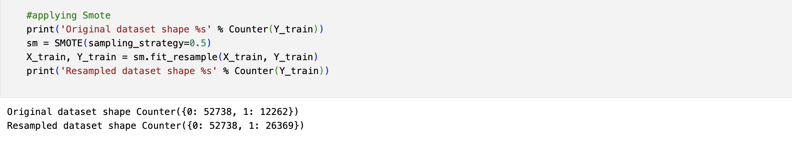

# Homesite Quote Conversion – ML Assignment & Kaggle Competition

# Problem Statement
The goal is to predict whether a customer will purchase an insurance quote, based on historical quote data. The binary target variable QuoteConversion_Flag presents a class imbalance challenge, where ~95% of observations are non-conversions.

# This project explores:
- How to handle imbalanced classification
- The role of SMOTE (oversampling)
- Power of Ensemble Learning (Stacking)
- Best practices in model evaluation

# Project Pipeline Overview
🔹 Step 1: Data Preprocessing
  -  Loaded raw data using pandas
  -  Removed ID-related columns
  -  Handled categorical variables:
  -  Used Label Encoding initially (for base modeling)
  -  Considered One-Hot Encoding for final ensemble
  -  Applied train_test_split to prepare validation set
  -  Scaled numeric features for models like SVM & MLP

🔹 Step 2: Exploratory Data Analysis (EDA)
  -  Checked null values, feature distribution, and class balance
  -  Observed: 65,000 rows × 596 features
  -  Highly imbalanced target variable
  -  Visualized correlations (optional heatmaps)
  -  Confirmed categorical dominance in features

🔹 Step 3: Handling Class Imbalance
  -  Used SMOTE (Synthetic Minority Oversampling Technique) to create synthetic samples of the minority class:
    
      

  -  Before: Class 1 = 5%
  -  After: Class 1 = 50%
Balanced data allowed models to better generalize to minority predictions.

🔹 Step 4: Base Models Trained
   

🔹 Step 5: Ensemble Learning (Stacking)
   Built a StackingClassifier with multiple base learners:
      # photo 
   -  Trained on SMOTE-balanced data
   -  Final predictions evaluated using AUC, accuracy
   -  Cross-validated over multiple folds

## photo
🔹 Step 6: Model Evaluation

      Used:
   -  confusion_matrix for true/false positive rates
   -  classification_report
   -  roc_auc_score across folds
# photos 
# Kaggle Submission & Comparison
   Model             Private Leaderboard Score
   Random Forest     0.857
   Stacked Ensemble  0.85246
   MLP / KNN / SVM   < 0.80

# Key Finding:
- While the Stacked Ensemble improved minority class prediction and generalization, Random Forest outperformed it in terms of raw leaderboard score.

# Key Learnings
- SMOTE dramatically improved minority class performance.
- Ensemble learning using stacking yielded robust, generalized results.
- Random Forest remains a powerful model for structured data.
- Model evaluation across folds is essential for measuring true performance.
- Tuning meta-models (e.g., GradientBoosting) is crucial in stacking.

# Future Enhancements
- Use XGBoost or LightGBM as meta learners in stacking.
- Explore Bayesian Optimization instead of RandomizedSearchCV.
- Try Cost-Sensitive Learning to penalize misclassification.
- Integrate SHAP for explainability.
- Move from Jupyter to Python script modules for scalable development.

